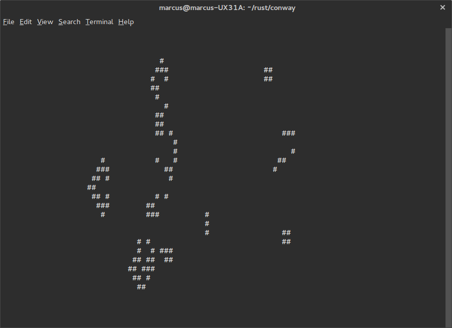

rust-conway
===========

This is a concurrent implementation of conway's game of life in rust. The game is played on fixed sized boards with hard borders. The evaluation of the next generation can be done concurrently. Adding a second thread reduces execution time by roughly 35% compared to completely sequential operation. Please note that this is not a high performance project. No clever tricks were used to speed up evaluation other than concurrency.

The project uses ncurses to display the board in the terminal.

In the future it may become possible to import patterns in RLE (run length encoding) as detailed [here](http://www.conwaylife.com/wiki/Run_Length_Encoded). This will probably be included as an independent library.

build
-----

1. [install rust and cargo](http://www.rust-lang.org/install.html)
2. `$ git clone https://github.com/marcusklaas/rust-conway.git`
3. `$ cd rust-conway`
4. `$ cargo build`
